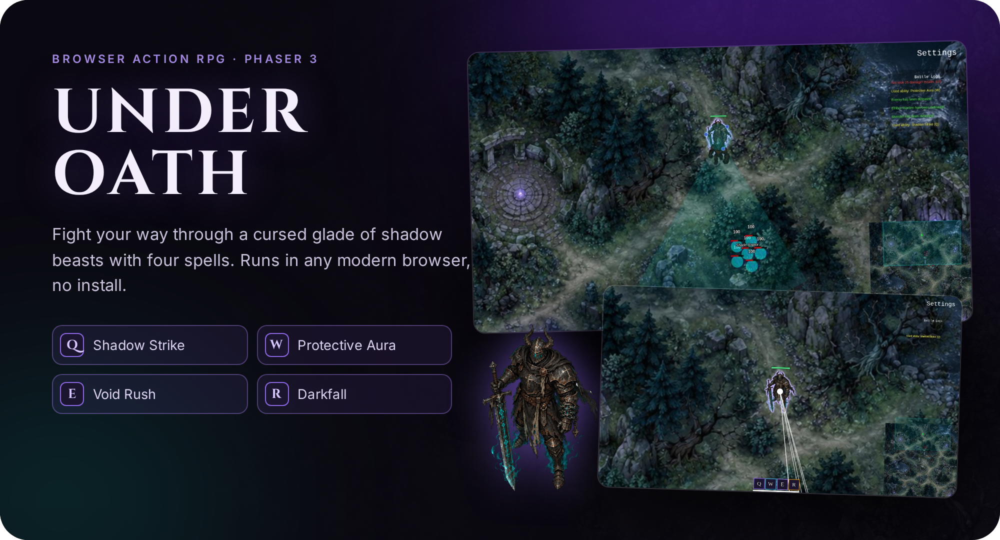
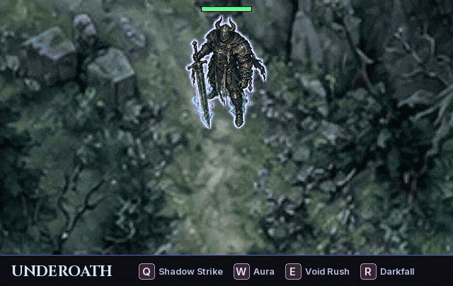
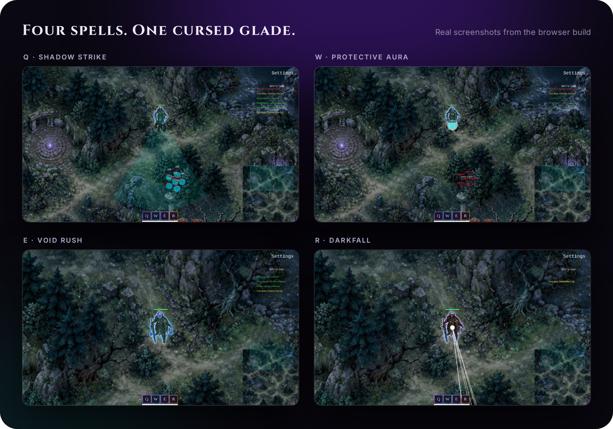
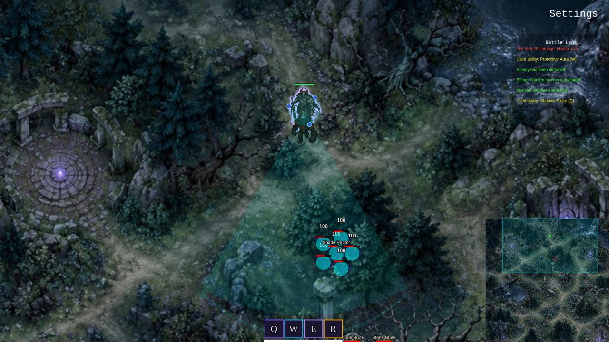
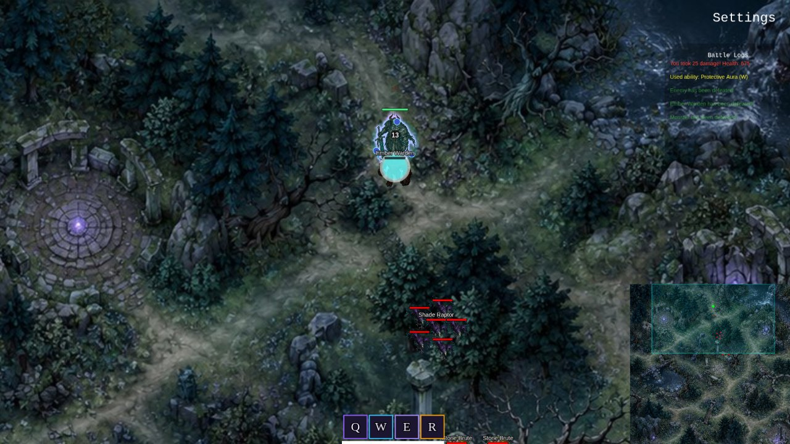
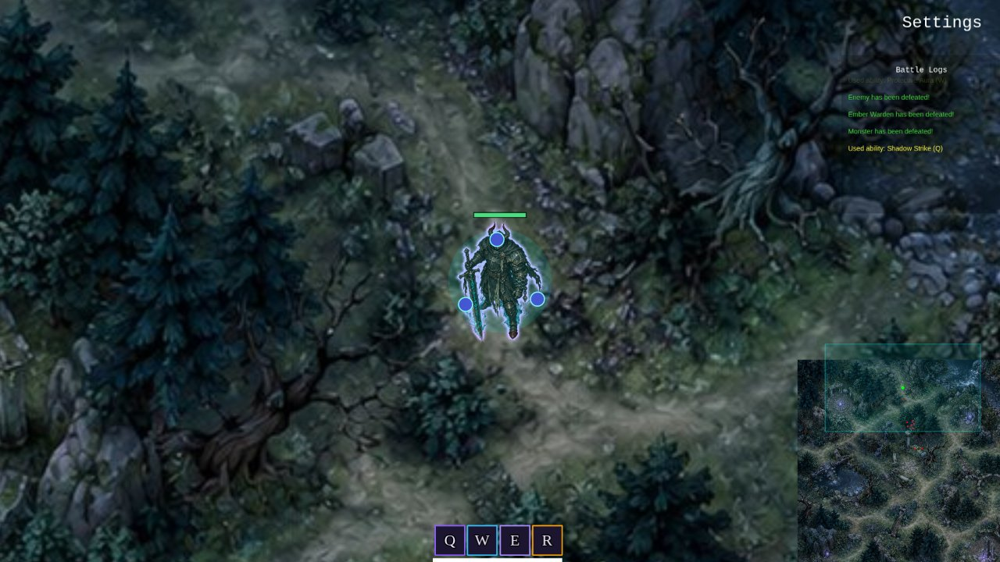
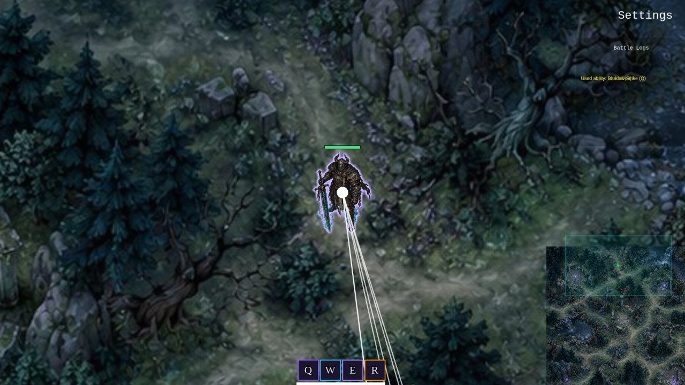
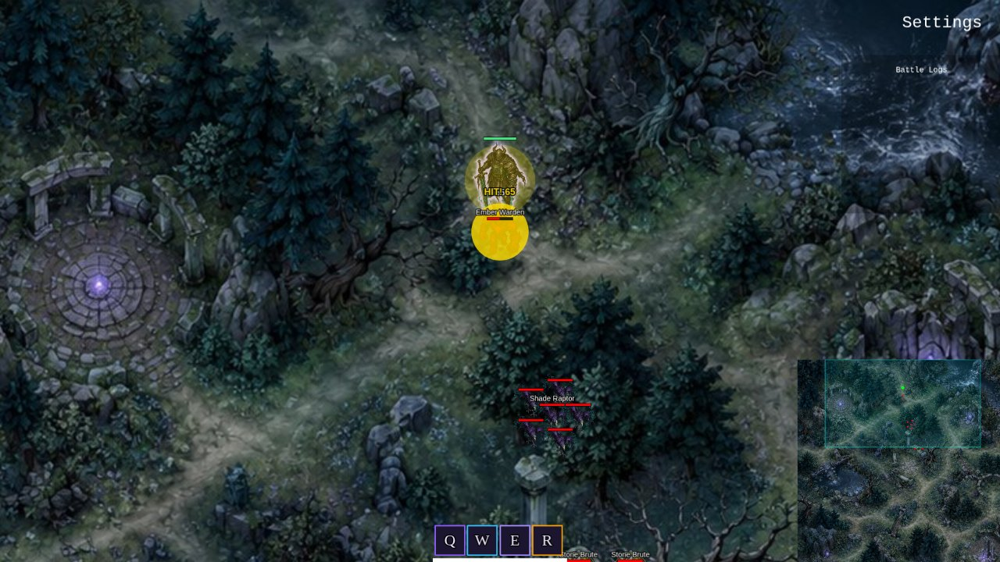
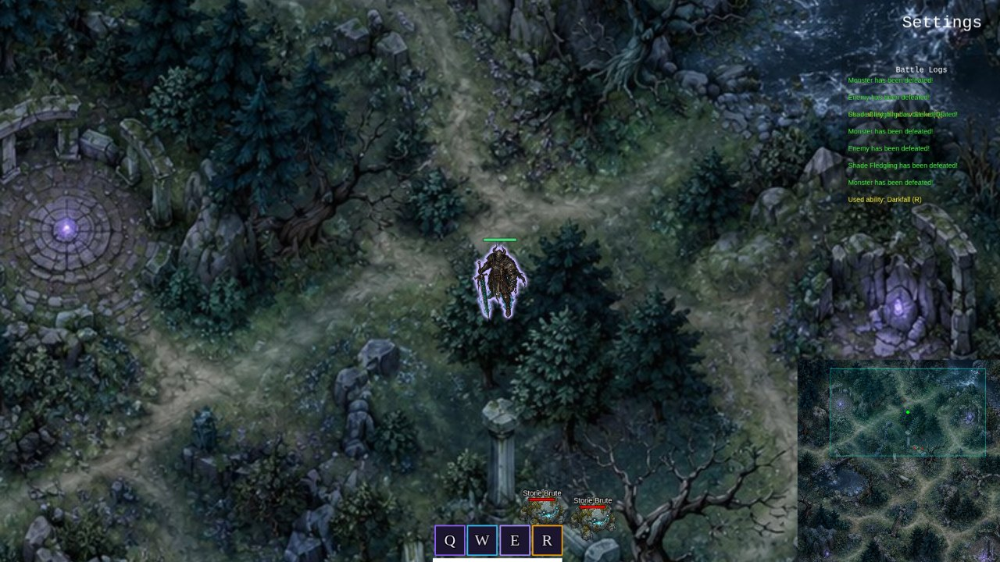

<div align="center">

<a href="docs/play/">
  
</a>

<br>

**[Demo](#see-it-play)** ·
**[Spells](#four-spells)** ·
**[How to play](#how-to-play)** ·
**[Run it](#run-it-locally)** ·
**[Assets and credits](#assets-and-credits)** ·
**[Landing page](docs/index.html)**

<br>

[](https://phaser.io)
[](https://nextjs.org)
[](https://www.typescriptlang.org)
[](LICENSE)

</div>

UNDEROATH is a small dark-fantasy action RPG that runs in the browser. You play an oath knight in a cursed forest glade, and you fight shade raptors, stone brutes and an ember warden with four spells.

It is a static Next.js site with a Phaser 3 game inside, so it needs no server, no account and no install. Enzi Studio built it in 2025 as a prototype. We are sharing it as-is.

## See it play

<div align="center">
  
  <br>
  <sub>A real play session of the browser build, recorded headless with Playwright. The strip under the video names the spell that was just cast.</sub>
</div>

<br>

<div align="center">
  
</div>

## Four spells

Each spell costs mana. The spells are named Q, W, E and R, and the keys 1, 2, 3 and 4 cast them by default. You can rebind them in Settings.

| Key | Spell | What it does |
| :-: | --- | --- |
| **Q** (1) | Shadow Strike | A bolt of dark energy in an arc. It hits everything in the cone and marks enemies for Void Rush. |
| **W** (2) | Protective Aura | Three spheres orbit the hero for five seconds and detonate when an enemy touches them. |
| **E** (3) | Void Rush | Dash to a marked enemy and hit it when you arrive. |
| **R** (4) | Darkfall | Pull every nearby enemy into the hero and hit them all for heavy damage. |

<table>
  <tr>
    <td width="50%"><br><sub><b>Q · Shadow Strike</b> hits a whole pack at once.</sub></td>
    <td width="50%"><br><sub><b>W · Protective Aura</b> orbs circle the hero.</sub></td>
  </tr>
  <tr>
    <td width="50%"><br><sub><b>E · Void Rush</b> closes the gap to a marked enemy.</sub></td>
    <td width="50%"><br><sub><b>R · Darkfall</b> pulls everything in.</sub></td>
  </tr>
</table>

## Features

- **Real-time combat** with click-to-move, a basic attack and four spells with mana costs.
- **Three monster camps.** The ember warden fights alone. The shade raptor pack has one large raptor and its fledglings. Stone brutes split into smaller brute shards when they die. A cleared camp comes back after four to five minutes.
- **HUD** with a health bar, the four spell slots, a minimap and a battle log of every hit, spell and kill.
- **Settings** for key bindings, hero speed and the battle log. They are saved in your browser (localStorage).
- **Camera control**: it follows the hero, you can pan with W A S D, and Space brings it back.
- **No network calls.** The game makes no requests outside its own files. There is no analytics and no tracking.

<table>
  <tr>
    <td width="50%"><br><sub>Exploring the glade. The minimap is at the bottom right.</sub></td>
    <td width="50%"><br><sub>The shade raptor camp.</sub></td>
  </tr>
</table>

## How to play

| Input | Action |
| --- | --- |
| Right-click the ground | Move |
| `G` | Attack the nearest enemy |
| `1` `2` `3` `4` | Cast Q, W, E, R |
| `W` `A` `S` `D` | Pan the camera |
| `Space` | Recentre the camera on the hero |
| `Esc` | Open the menu |

A desktop browser with a keyboard and mouse works best. This is a sandbox prototype: you clear camps, but there is no levelling, story, boss fight or ending yet. The code has an unused Dark Lord enemy and a victory screen that the current build never reaches.

## Run it locally

You need [Node.js](https://nodejs.org) 18 or newer.

```bash
git clone https://github.com/enzihub/underoath.git
cd underoath
npm install
npm run dev          # http://localhost:8080 with hot reload
```

To build the static game and serve it:

```bash
npm run build        # writes the static site to dist/
npm start            # serves dist/ on http://localhost:3000
```

The `dist/` folder is plain HTML, JS and images. You can upload it to any static host.

### Build for a sub-path

`docs/play/` in this repo is a prebuilt copy of the game, ready for a static host that serves the `docs/` folder. To rebuild it:

```bash
npm run build:pages  # builds with base path /underoath/play and copies dist/ to docs/play/
```

If you host it under a different path, set `NEXT_PUBLIC_BASE_PATH` yourself, for example `NEXT_PUBLIC_BASE_PATH=/my-game npm run build`.

### Project layout

```
src/app/            Next.js page that mounts the game
src/game/scenes/    Boot, MainMenu, Game, HUD, Settings and GameOver scenes
src/game/objects/   Champion (the hero), Enemy and JungleMonster
src/game/systems/   camp spawning and respawns, events, local score store
public/assets/      the map, hero and creature images
docs/               landing page (index.html) and the prebuilt game (play/)
assets/             README images, plus the HTML sources that render them
```

## Changes for this release

This repo is a fresh export of the 2025 project. These things changed before it was published:

- **New art.** The original prototype used placeholder art from another game. That art was removed. The map, the hero and the three creatures are new images.
- **New names.** The spells and creatures were renamed to original names.
- **Easier to read in play.** The hero has a soft violet outline and a green health bar above the head. The small pack creatures (shade fledglings and brute shards) no longer show name labels. The spell slots in the HUD are now dark tiles with coloured rims and Q, W, E, R letters.
- **No external requests.** A build-time script that sent data to an outside server was removed, together with a remote particle atlas and a hosted web font. The leaderboard API route was replaced with localStorage.
- **Unused template files removed**, including the template logo, sample images and a sound file of unknown origin.
- **Default attack key** is now `G` everywhere. Before, one code path used `A`, which clashed with camera panning.

## Assets and credits

| Asset | Where | Source | Licence |
| --- | --- | --- | --- |
| World map | `public/assets/images/world_map.jpg` | New art made by Enzi Studio with ChatGPT Images | MIT, with this repo |
| Oath knight (hero) | `public/assets/images/hero/oathknight.png` | New art made by Enzi Studio with ChatGPT Images | MIT, with this repo |
| Ember warden, shade raptor, stone brute | `public/assets/images/creatures/` | New art made by Enzi Studio with ChatGPT Images | MIT, with this repo |
| Background gradient | `public/assets/bg.png` | Phaser Editor Next.js template | MIT, © 2024 Phaser (notice in [LICENSE](LICENSE)) |
| Spell effects, health bars, Dark Lord shape | drawn in code (`src/game/utils/AssetGenerator.ts`) | Enzi Studio | MIT, with this repo |
| Cinzel and Inter fonts | `docs/fonts/` (landing page and README art only) | The Cinzel Project Authors, The Inter Project Authors | SIL Open Font License 1.1 ([docs/fonts/OFL.txt](docs/fonts/OFL.txt)) |
| Screenshots, demo GIF, hero and collage images | `assets/` | Captured from the real game by Enzi Studio | MIT, with this repo |

Engine and frameworks: [Phaser 3](https://phaser.io) (MIT), [Next.js](https://nextjs.org) (MIT) and [React](https://react.dev) (MIT).

### Credits

Built by **Enzi Studio**.

Contributors to the original project:
[@RukshanJS](https://github.com/RukshanJS),
[@kavishkanimsara](https://github.com/kavishkanimsara),
[@ZainAli104](https://github.com/ZainAli104),
[@bb-xops](https://github.com/bb-xops) and
[@sun2ii](https://github.com/sun2ii).

## Status

Built by Enzi Studio in 2025 and shared as-is. We do not plan more work on it, but issues and pull requests are welcome. To report a security problem, please use [private vulnerability reporting](../../security/advisories/new) and not a public issue.

## Licence

[MIT](LICENSE). Copyright (c) 2025-2026 Enzi Studio (Harry Edwards). The Phaser template notice for `bg.png` is in the same file.
